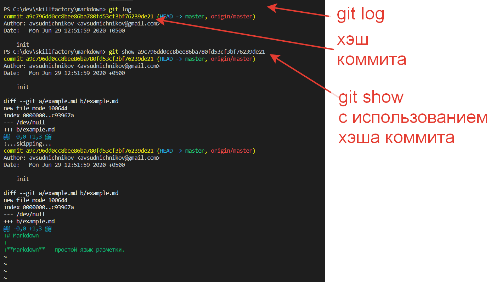

[<<к содержанию](./readme.md) 

# Получение данных о состоянии репозитория
## git status 
позволяет отследить состояние репозитория. Позволяет узнать, какие изменения необходимо зарегистрировать Git (при необходимости — отменить).

## git log 
покажет список последних коммитов и их хеши SHA1. Список выводится начиная с последнего коммита.

## git show [хэш] 
показывает информацию по определённому коммиту.

