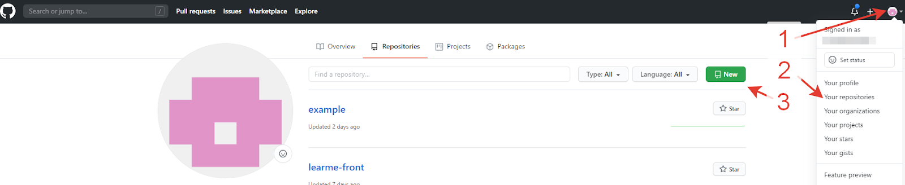

**GitHub** является сегодня наиболее популярным хостингом IT-проектов, на нём хранятся миллионы удалённых репозиториев, как небольших команд, так и крупных корпораций.

Веб-сервис основан на системе контроля версий Git и запущен компанией GitHub, Inc в 2008 году. В настоящее время (с 2018 года) владельцем GitHub является Microsoft.


Отличительная особенность GitHub — лёгкое создание форков. Создание форков на GitHub осуществляется нажатием лишь одной кнопки.

В возможностях этого IT-хостинга, за исключением возможностей системы контроля версий, есть:

```
- Ведение документации (wiki) проекта,
- Трекинг задач (issues),
- Приём пожертвований.
```
Небольшие проекты и проекты с открытым исходным кодом имеют те же возможности на GitHub, что и крупные коммерческие проекты, но для них использование хостинга бесплатно.

## Регистрация на github

- Перейдите по [ссылке](https://github.com/)
- Выберите «Sign up».
- Заполните информацию.
- Нажмите кнопку «Create account».
- Войдите в почту, подтвердите почтовый адрес.

## Создание проекта на github

Для создания репозитория на GitHub используйте кнопку «new» на главной странице или на странице со списком репозиториев.




После создания удаленного репозитория свяжите проект с ним.

 [<<<начало](./readme.md) 