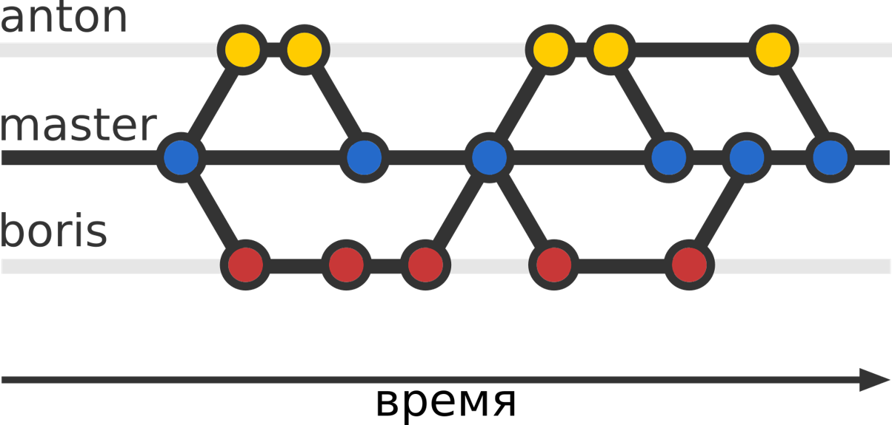

## ``Central Workflow``

Репозиторий содержит только одну главную ветку master. Все изменения комитятся в нее. Репозиторий может быть как локальным, так и удаленным.

Используется для одиночного ведения проекта

## ``Developer Branch Workflow``
Вся работа может быть выполнена на разных ветках, но потом должна будет слита (merged) в одну главную ветвь.

Больше подойдет для небольшого проекта с ограниченным количеством требований и небольшим количеством разработчиков. Наиболее вероятный сценарий для группового учебного проекта, когда каждый участник делает свою часть, а затем публикует её в удаленном репозитории для того, чтобы остальные её увидели до того, как она будет слита.

## ``Feature Branch Workflow``

В этом случае репозиторий имеет второстепенную основную ветку (dev), в которой находится стабильный код для отправки пользователям. Фичи начинают свой код от этой ветки и сливаются с ней. 

Командное управление проектами.

## ``Issue Branch Workflow``

Очень похоже на Feature Branch Workflow, однако есть существенное отличие — ветки создаются по задачам, поставленным перед разработчиками, а не по фичам, а каждая фича может состоять из нескольких отдельных задач.

Так же как и предыдущая для командной работы.

## ``Forking Workflow``

В рамках Forking Workflow стратегии разработка ведется так, что есть два репозитория:

- Оригинальный репозиторий, в который будут сливаться все изменения.
- Форк репозитория (это копия оригинального репозитория во владении другого разработчика, который хочет внести изменения в оригинальный).

Чаще всего используется в проектах с открытым исходным кодом и публичными репозиториями. Каждый, кто может просматривать репозиторий, может сделать разветвление. Если кто-то из разработчиков сделает какие-то изменения, он может предложить его владельцу основного репозитория.

## ``Github flow``

Команда Github предпочитает достаточно простую стратегию ветвления, которую можно описать несколькими правилами:

1. Код в master ветке должен быть работоспособным и готовым к развертыванию в любое время;
2. Все изменения производятся в отдельных ветках, созданных от master;
3. Когда изменение завершено, его проверяет руководитель команды и ещё один специалист;
4. После удачной проверки изменения его вливают в проект и немедленно разворачивают на сервере.

Стратегия может вполне подойти командам, работающий по гибким методологиям управления проектами и учебным командам.

## ``Gitflow``

В целом, Gitflow состоит из двух постоянных веток и нескольких типов временных веток.

Существует две постоянных ветки:

1. production (обычно — master) — стабильная ветка, доступная пользователям. Напрямую в production изменения не производятся;
2. develop — ветка для разработки. Потенциально она может быть нестабильна. При достаточном количестве изменений из develop создаётся release-ветка. Feature-ветки берут свое начало от develop.
Остальные ветки делятся на три группы:

1. feature — ветки, на которых разрабатывается новый функционал. При завершении работы над функционалом feature-ветки сливаются в develop;
2. release — ветки, на которых идёт подготовка стабильного кода для публикации пользователям. По завершении работ по «стабилизации» кода, ветка сливается в production и develop;
3. hotfix — ветки, служащие для быстрого решения критических проблем production. По завершении работ по решению ошибки, ветка сливается в production и develop.

Данная модель подходит для организации рабочего процесса на основе релизов.

[<<<назад](./readme.md) 