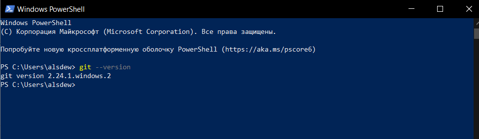

## Установка GIT в Windows

Проверка наличия GIT:

```
> git --version
```
Если GIT уже был установлен, вам отобразится его версия:



Для установки GIT перейдите на [страницу](https://git-scm.com/download/win), скачайте подходящий дистрибутив и следуйте инструкциям.

[<<начало](./readme.md) 
